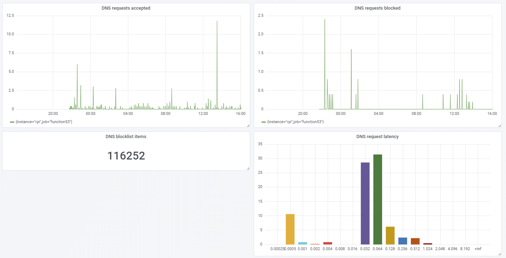

[](https://github.com/function61/function53/releases)
[](https://hub.docker.com/r/fn61/function53/)

What
----

A DNS server for your LAN that blocks ads/malware and encrypts your DNS traffic.

Designed to work on Raspberry Pi (much like Pi-hole), but works elsewhere as well.




Why?
----

The below features were important to me, so let's compare what's available:

| Project        | Ad blocking | Encrypted DNS | Metrics | Query latencies | Clean install | Reasonable programming language |
|----------------|-------------|---------------|---------|-----------------|---------------|---------------|
| function53     | ✓           | ✓             | ✓       | ✓               | ✓             | ✓ (Go)        |
| dnscrypt-proxy | ✓           | ✓             | [Not coming](https://github.com/jedisct1/dnscrypt-pro✓y/issues/337) | No | ✓ | ✓ (Go) |
| coredns        | [Maybe coming](https://github.com/coredns/coredns/issues/2267) | ✓             | ✓       | ✓               | ✓             | ✓ (Go) |
| pihole         | ✓           | [Manual config](https://docs.pi-hole.net/guides/dns-over-https/) | [Plugin](https://github.com/eko/pihole-exporter)  | No (average latency, but no distribution) | No | No (PHP) |
| AdGuard        | ✓           | ✓             | [Not yet](https://github.com/AdguardTeam/AdGuardHome/issues/516) | No (average latency, but no distribution) | ✓ | ✓ (Go) |

Definitions:

| Term            | Definition                    |
|-----------------|-------------------------------|
| Encrypted DNS   | DoH (DNS-over-HTTP) or DoT (DNS-over-TLS, i.e. TCP-flavoured DNS but over TLS) |
| Metrics         | Prometheus-compatible metrics (some projects might have built-in-only metrics, but that's not enough) |
| Query latencies | Metrics should include query latency distribution |
| Clean install   | Minimal changes to the system, preferably single binary (Pi-hole needs so many dependencies, and even the Docker image for Pi-hole looks too complicated.) |
| Reasonable programming language | Uses memory safe, typed programming language |

I also had [reliability problems with dnscrypt-proxy](https://github.com/coredns/coredns/issues/2267#issuecomment-450131975).


How to install
--------------

### Docker

```console
$ docker run -d \
	--name function53 \
	--restart always \
	--net host \
	fn61/function53:TAG
```

Note:

- You can find the tag from Docker Hub
- It starts with reasonable default config. If you want to customize it, add `-v /home/pi/function53/config.json:/function53/config.json` to `$ docker run ..`


### Manual install

This assumes you're using Raspberry Pi. The URL is different for amd64.

```
$ mkdir ~/function53 && cd ~/function53/
$ VERSION_TO_DOWNLOAD="..." # find this from Bintray. Looks like: 20180828_1449_b9d7759cf80f0b4a
$ sudo curl --location --fail --output function53 "https://dl.bintray.com/function61/dl/function53/$VERSION_TO_DOWNLOAD/function53_linux-arm" && sudo chmod +x function53
$ ./function53 write-default-config
$ cat config.json

... inspect the configuration to see if it suits you

$ ./function53 write-systemd-unit-file
Wrote unit file to /etc/systemd/system/function53.service
Run to enable on boot & to start now:
        $ systemctl enable function53
        $ systemctl start function53
        $ systemctl status function53
```

NOTE: You may need `$ sudo` for some of those commands.

After starting function53, check with `$ dig` or `$ nslookup` (nslookup works the same on
Windows if you like it better) that the name resolution works:

```
$ nslookup joonas.fi <ip of your DNS server>
$ dig joonas.fi @<ip of your DNS server>
```

To test ad blocking, lookup `adtech.de`.


Links
-----

- https://github.com/jedisct1/dnscrypt-proxy/wiki/Public-blacklists
- https://dnscrypt.info/public-servers/


How to build & develop
----------------------

[How to build & develop](https://github.com/function61/turbobob/blob/master/docs/external-how-to-build-and-dev.md)
(with Turbo Bob, our build tool). It's easy and simple!
